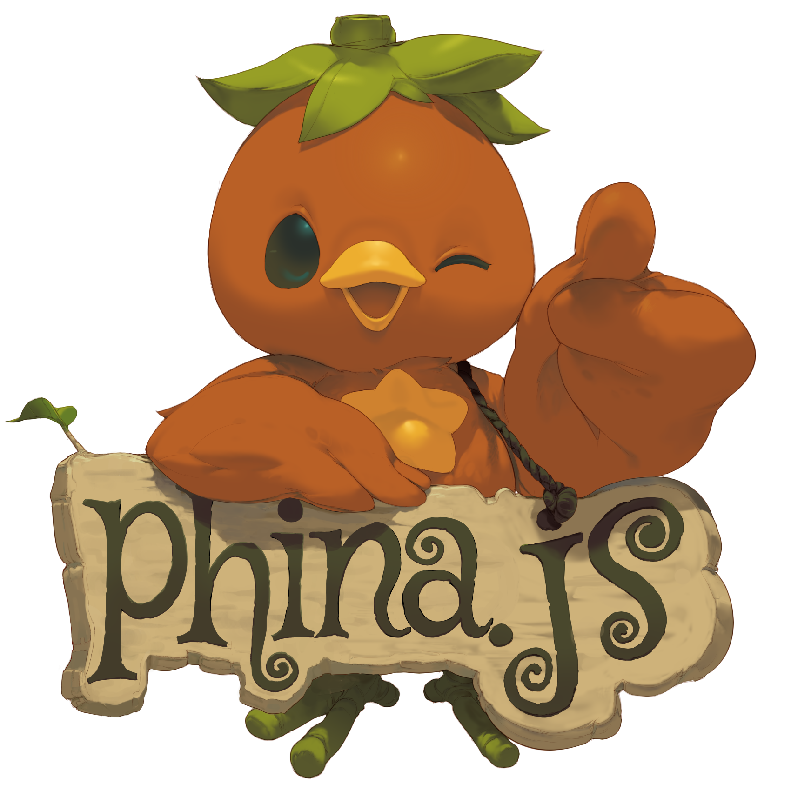

# phina.js

[](https://gitter.im/phi-jp/phina.js?utm_source=badge&utm_medium=badge&utm_campaign=pr-badge&utm_content=badge)



phina.js is game library.

## Official

http://phinajs.com


## Usage

**Browser**

```html
<script src='https://rawgit.com/phi-jp/phina.js/v0.1.2/build/phina.js'></script>
<script>
phina.main(function() {
  console.log(phina.VERSION) // show version
});
</script>
```

**Node.js**

```js
var phina = require('phina.js');
console.log(phina.VERSION) // show version
```

**Runstant**

[Getting started](http://goo.gl/xgyU6f)


## for developer

### clone

```
$git clone https://github.com/phi-jp/phina.js.git
$cd phina.js
```

### setup

```
$npm install -g gulp
$npm install
```

### build

```
$gulp
```

### develop

watch and launch

```
$gulp dev
```
